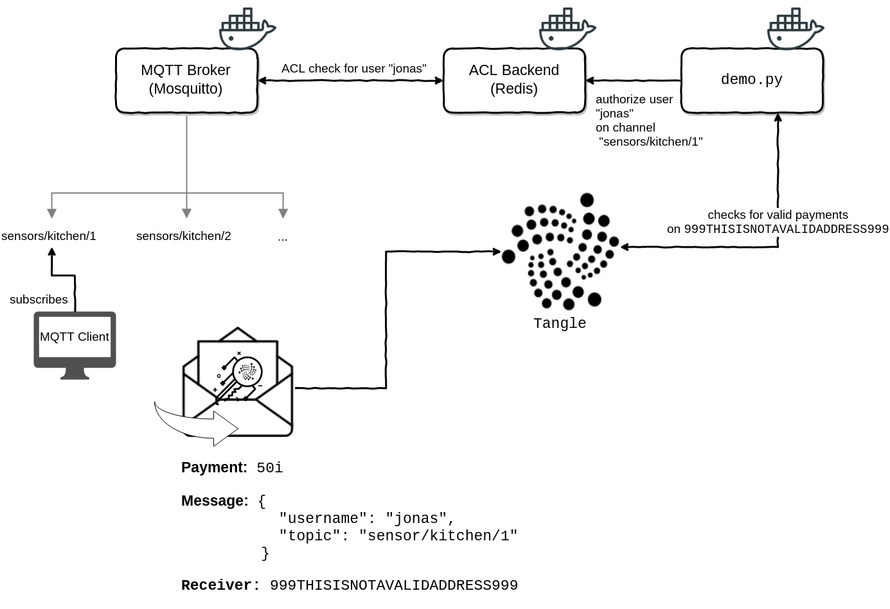

# IOTA-DEMO-PYTHON

This is a small demo application that searches for incoming transactions on a given IOTA address and authorizes a user to receive data on a MQTT broker, depending on the payload of the transaction.



## How to start the demo

#### TL;DR

1. Install `docker` and `docker-compose` for your OS from [here](https://docs.docker.com/compose/install/).
2. Clone (`git clone https://github.com/joWeiss/iota-demo-python.git`) or
   [download](https://github.com/joWeiss/iota-demo-python/archive/master.zip) this repo.
3. Open the folder in a terminal and start the services with `docker-compose up`.


## Usage

The user has to send a transaction to a specified address. The transaction value has to be a multiple of `VALUE_PER_TEN_SECONDS` and has to carry a message in JSON format like this:

```json
{"username": "jonas", "topic": "mytopic"}
```

This allows the user to connect to the broker, e.g.:

```bash
$ mosquitto_sub --username jonas --password jonas-mytopic --topic mytopic
```

## Configuration

You can configure the following settings:

- in `docker-compose.yml`:
    - `IOTA_NODE`: The iota node to connect to (Default: https://potato.iotasalad.org:14265)
    - `REDIS_HOST`: The redis-backend for the ACL (Default: redis)
    - `VALUE_PER_TEN_SECONDS`: The amount of IOTA (i) that enables 10 seconds of access (Default: 1)
- as an environment variable:
    - `ADDRESS`: The receiving IOTA address for payments (Required)

To allow unconfirmed transactions to be processed, add the flag `--allow-unconfirmed` to the `command` field in `docker-compose.yml`:

```yml
services:
  iota:
    ...
    command: ["--allow-unconfirmed", "$ADDRESS"]
```


---

If you like the demo and you want to buy me a coffee/beer/drink/whatever, I'm thankful for all donations.

IOTA: QQAVKVQSIBFLQMWDZYMERZIMMT99Y9YSWRWZHLTCDMRWHPEDULQHPMZAMVSPRJJ9POIOJRZIUMVIECXC9AVVDWOWKD

BTC: bc1qsswmasrc3jlhr2z562jlqjyw4cvu8kpu2ju704

BTC (segwit): 393xkxrFuvC4h6o3Y6sPXbwuBdrTqBfxZw